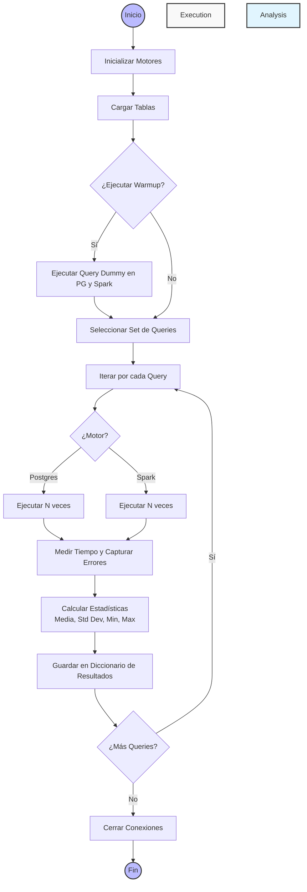

```mermaid
flowchart TD
%% Nodos principales
Start((Inicio)) --> Init[Inicializar Motores]
Init --> LoadData[Cargar Tablas ]
LoadData --> Warmup{¿Ejecutar Warmup?}

%% Fase de Calentamiento
Warmup -- Sí --> RunWarmup[Ejecutar Query Dummy en PG y Spark]
RunWarmup --> MainLoop
Warmup -- No --> MainLoop

%% Fase de Ejecución

    MainLoop[Seleccionar Set de Queries] --> IterateQ[Iterar por cada Query]
    IterateQ --> SelectEngine{¿Motor?}
    
    SelectEngine -- Postgres --> RunPG[Ejecutar N veces]
    SelectEngine -- Spark --> RunSpark[Ejecutar N veces]
    
    RunPG --> Measure[Medir Tiempo y Capturar Errores]
    RunSpark --> Measure
    
    Measure --> Stats[Calcular Estadísticas\nMedia, Std Dev, Min, Max]
    Stats --> Store[Guardar en Diccionario de Resultados]
    
    Store --> MoreQueries{¿Más Queries?}
    MoreQueries -- Sí --> IterateQ


MoreQueries -- No --> Cleanup[Cerrar Conexiones]
Cleanup --> End((Fin))

%% Estilos
style Execution fill:#f9f9f9,stroke:#333,stroke-width:2px
style Analysis fill:#e1f5fe,stroke:#333,stroke-width:2px
style Start fill:#bbf,stroke:#333,stroke-width:2px
style End fill:#bbf,stroke:#333,stroke-width:2px
```